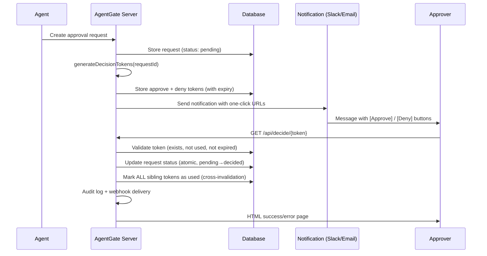

# Decision Tokens & One-Click Links

Decision tokens let approvers **approve or deny requests with a single click** from notifications (Slack, email, etc.) without needing to log into the AgentGate UI or call the API.

## How It Works



## Token Generation

When a notification is sent for a pending approval request, the server calls `generateDecisionTokens(requestId)` which:

1. **Verifies** the request exists and is in `pending` status — **returns `null` if the request doesn't exist or is not in `pending` status**
2. **Generates** two cryptographically secure tokens (32 random bytes, base64url-encoded) — one for approve, one for deny
3. **Stores** both tokens in the `decisionTokens` table with an expiry timestamp
4. **Returns** a `DecisionTokens` object containing token strings, full URLs, and expiry info

Each token is a 43-character base64url string (256 bits of entropy), making brute-force infeasible.

### Token Pair Structure

```typescript
interface DecisionTokens {
  approve: { token: string; url: string };  // e.g. https://gate.example.com/api/decide/abc123...
  deny:    { token: string; url: string };
  expiresAt: string;       // ISO 8601
  expiresInHours: number;  // from config
}
```

## Token Lifecycle

| Stage | What Happens |
|-------|-------------|
| **Created** | Two tokens (approve + deny) stored in DB with `expiresAt`, `usedAt = null` |
| **Delivered** | URLs embedded in Slack messages, emails, etc. as clickable buttons/links |
| **Consumed** | Approver clicks link → `GET /api/decide/:token` → request decided |
| **Cross-invalidated** | On consumption, **all** unused tokens for the same request are marked as used |
| **Expired** | Tokens past `expiresAt` are rejected even if not yet used |

### Cross-Token Invalidation

When any token for a request is consumed, the server marks **all sibling tokens** for that request as used in a single DB operation:

```sql
UPDATE decision_tokens SET used_at = NOW()
WHERE request_id = :requestId AND used_at IS NULL
```

This means:
- If someone clicks **Approve**, the **Deny** link immediately becomes invalid (and vice versa)
- If multiple token pairs were generated (e.g., notification resent), all previous tokens are also invalidated
- The approval request itself is atomically updated from `pending` to the decided status, preventing race conditions between concurrent clicks

### Race Condition Protection

The decision endpoint uses an atomic conditional update:

```sql
UPDATE approval_requests SET status = :decision
WHERE id = :requestId AND status = 'pending'
```

If two tokens are clicked simultaneously, only the first succeeds — the second sees zero rows updated and returns "Already Decided" (HTTP 409).

## Configuration

| Environment Variable | Config Key | Default | Description |
|---------------------|-----------|---------|-------------|
| `DECISION_TOKEN_EXPIRY_HOURS` | `decisionTokenExpiryHours` | `24` | Hours until tokens expire. Must be ≥ 1 (integer). |
| `DECISION_LINK_BASE_URL` | `decisionLinkBaseUrl` | `http://localhost:{port}` | Base URL for decision links. **Must be set in production** to your public-facing URL. |

### Example

```env
DECISION_LINK_BASE_URL=https://gate.example.com
DECISION_TOKEN_EXPIRY_HOURS=48
```

This produces links like: `https://gate.example.com/api/decide/Ks8f2m...`

> **Important:** If `DECISION_LINK_BASE_URL` is not set, links default to `http://localhost:{port}`, which won't work for external approvers.

## CSRF Protection

The decision endpoint sets the `Referrer-Policy: no-referrer` header on every response. Additionally, the HTML pages include `<meta name="referrer" content="no-referrer">`.

This prevents the token from leaking via the `Referer` header if the response page contains any external links. Since tokens are single-use and consumed on the GET request itself, the primary attack surface is token interception in transit — use HTTPS in production.

**Security properties of the token endpoint:**
- Tokens are single-use (consumed on first valid request)
- No authentication required (the token *is* the credential)
- GET-based for maximum compatibility (email clients, Slack previews)
- Cross-invalidation prevents the "other button" from working after a decision

## Troubleshooting

### "Invalid Token" (HTTP 404)

The token was not found in the database.

**Causes:**
- URL was corrupted (partial copy-paste, line break in email)
- Token was already cleaned up by a database maintenance job
- The token never existed (typo or fabricated URL)

**Fix:** Request a new notification with fresh decision links.

### "Link Expired" (HTTP 400)

The token exists but its `expiresAt` timestamp has passed.

**Causes:**
- Too much time elapsed between notification and click (default: 24 hours)
- Server clock skew between token generation and validation

**Fix:** Increase `DECISION_TOKEN_EXPIRY_HOURS` if the default is too short for your workflow. The request can still be decided via the API or UI if it's still pending.

### "Already Used" / "Already Decided" (HTTP 400 / 409)

- **Already Used (400):** This specific token's `usedAt` is set — it (or a sibling) was already consumed.
- **Already Decided (409):** The approval request itself is no longer `pending` — someone already decided it (via token, API, UI, or auto-policy).

**Causes:**
- Another approver clicked their link first
- The approve/deny counterpart was already used (cross-invalidation)
- The request was decided through another channel (API, UI, auto-expiry)

**Fix:** No action needed — the request has already been resolved. Check the response details or audit log for who decided and when.
